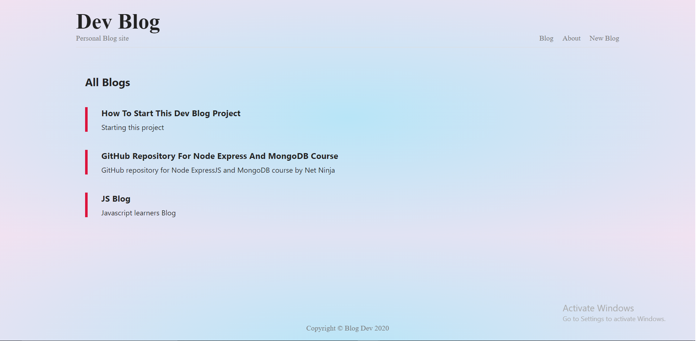

# Dev Blog 
### My personal Blog site
<br />

**Dev Blog** is my personal blog website where I can keep track of my projects and  
<br />

## The website is build using : 

> Node JS 

> Express JS

### Database :
> MongoDB

<br />

### **Website Preview**
<br />

 
<br />
<br />

Use the following commands to run website
```
git clone

npm install

nodemon app
```

Now enter this in your browser
[https://localhost:3000/blogs](https://localhost:3000/blogs)